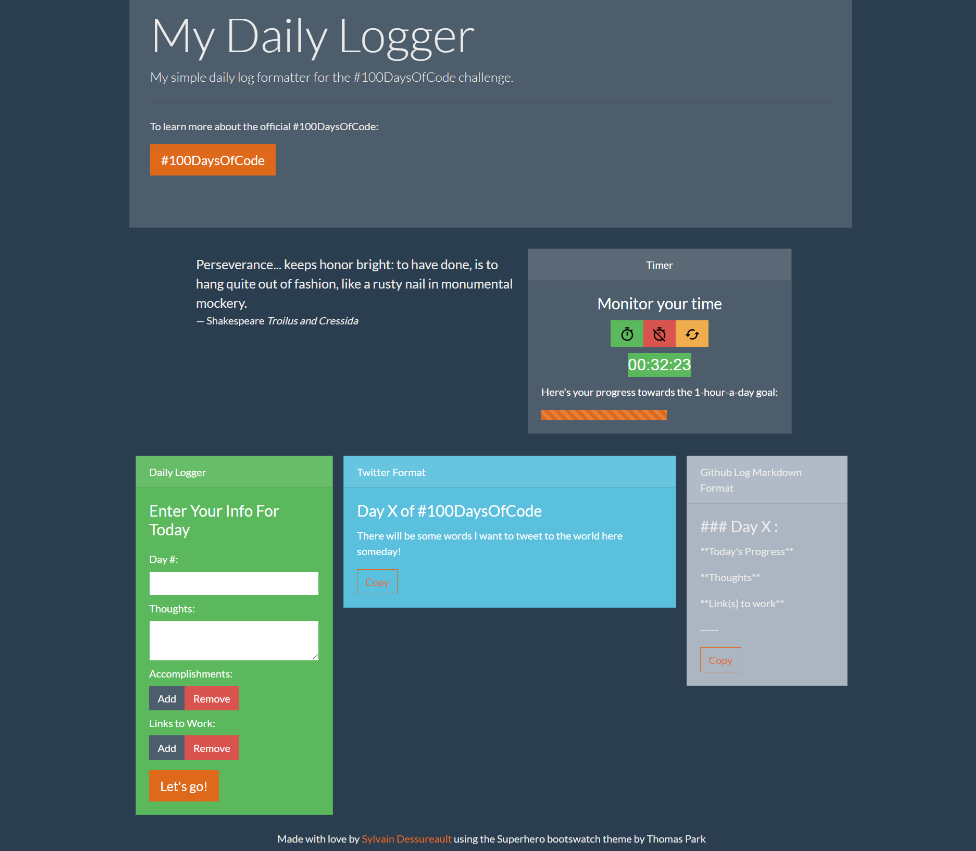

# My Daily Logger

A simple daily log formatter for the #100DaysOfCode challenge.

## Use It

You can [go here](https://sylvaindessureault.com/100daysofcode-daily-logger/) if you want to try it out!

## Purpose

I created this to optimize the daily logs for the #100DaysOfCode challenge.

To gain efficiency, we can start the timer and then just enter all the daily information as we progress for that day.

When finished, click on the format button and then, on the right side of the screen, the log is formatted both for a Twitter post and for the daily log on Github in markdown format. Thus, with the click of a button, we can then just copy, paste and post on the appropriate platform!

## Screenshot

## License

MIT.

[Bootswatch](https://bootswatch.com/) theme by [Thomas Park](https://thomaspark.co/).
